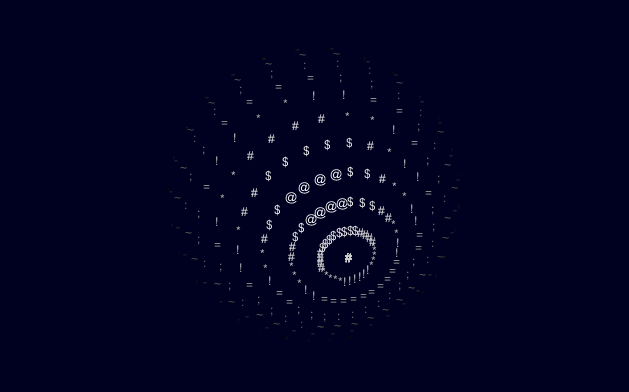

# ascii_3d_sphere
Friday night fright with processing &amp; ascii 3d sphere renderer.

The process is simple:
* generate a 3d sphere 
* rotate and translate it
* project 3d->2d
* and render using either dots or letters

No external dependencies, no p3d or other math libraries required.

